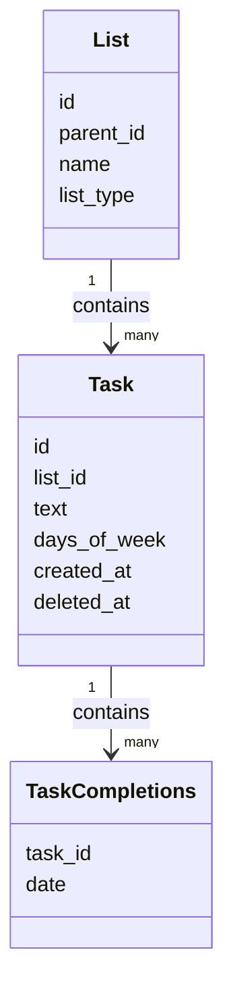
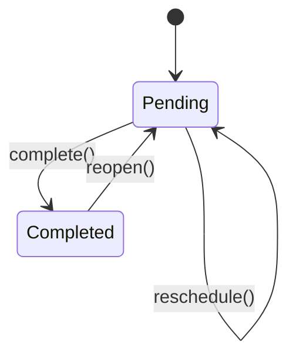

# Domain Model

---

## Task
A unit of work.

Rules:
- A task belongs to exactly one list
- Task completion ("done") is defined by TaskCompletions
- A task may repeat (for daily tasks)
- Tasks are immutable in recurrence behavior. A change in 'days_of_week' must generate a new task, preserving history
- A change in recurrence must "soft-delete" a task (mark as deleted_at)
- A task is active if deleted_at is NULL
- days_of_week must contain at least one day when not NULL

Attributes:
- id 
- list_id 
- text 
- days_of_week (NULL if non-repeatable, else: int[] (0-6))
- created_at 
- deleted_at (NULL)

---

## TaskCompletions
Used to track completion events for all tasks

Rules:
- Each completion belongs to one task
- Task + Date are to be used as unique identifiers, and cannot be repeated across completions
- TaskCompletions are created when a task is marked as "done", and deleted when marked as "not done" again
- If task's days_of_week is NULL, it can only have 1 Task Completion at most
- Completions can only be created for active tasks
- Date hold the effective date, meaning the day when the completion applies to (e.g. date of the recurring task)
- For non-recurring tasks (days_of_week IS NULL), date is always set to the current user-local date
- For recurring tasks (days_of_week NOT NULL), Date must be provided AND must match the task's days_of_week

Attributes:
- task_id
- date (user-local date, without timezone to minimize complexity and avoid conflicts)

---

## List
Depending on its type, a list may contain tasks or other lists.

Types:
- todo: contains regular tasks. One fixed list for regular tasks.
- daily: displays recurring tasks, which refresh according to days_of_week. One fixed list for daily tasks.
- collection: groups other lists for categorization. Lists can be 'todo' or 'daily'

Rules:
- A todo or daily list contains tasks
- A collection list contains other lists
- Tasks in a todo list must have days_of_week = NULL
- Tasks in a daily list must have days_of_week != NULL
- Daily lists display tasks for a given date in user-local time
- A list may belong to at most one collection
- Only collection lists can be parents
- Only todo and daily list can have parents (parent_id)

Attributes:
- id
- parent_id (NULL if doesn't belong to a collection)
- name
- list_type

---

## Diagrams

### Core Domain Relationships

### TODO: Task Lifecycle with Sync

