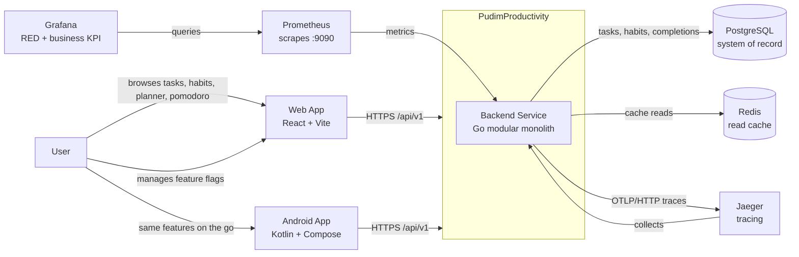

# C4 — System Context Diagram

> Level 1 of the C4 model. Shows the system under discussion as a black box and
> its relationships with users and external systems.
> Rendered from the Mermaid block below on GitHub and GitLab.

## Diagram

## Elements

| Element | Type | Description |
|---------|------|-------------|
| **User** | Person | Single-user MVP: creates/edits tasks, tracks habits, plans the week, runs pomodoro sessions. |
| **Web App** | System | React SPA served by Vite/nginx. Real-time updates via WebSocket. |
| **Android App** | System | Kotlin/Compose client with foreground focus-timer service and local planner alarms (WorkManager). |
| **Backend Service** | System | Go modular monolith (`internal/`): task, tasklist, planner, pomodoro, featureflag, sync (WS), audit. Single process, per-module packages. |
| **PostgreSQL** | External system | System of record. Migrations via embedded SQL (`embed.FS`). |
| **Redis** | External system | Optional read-through cache for the task list API + cross-instance sync fabric. Degrades gracefully. |
| **Prometheus / Grafana / Jaeger** | External systems | Observability stack (metrics on :9090, RED + business-KPI dashboards, OTLP traces). |

## Relationship Notes

- The **database is the system of record**; WebSocket events are a convenience
  derived from committed state (ADR 004).
- **Redis is optional at runtime**: the backend starts without it, so a
  single-process CI smoke test needs only PostgreSQL.
- The API is **unauthenticated in dev** (dev identity headers); JWT + per-user
  scoping are documented P0 items in the threat model.
