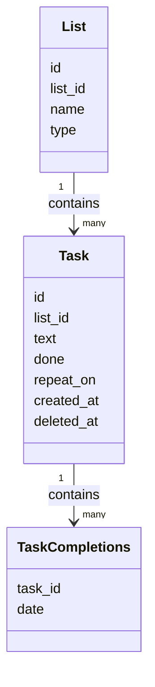
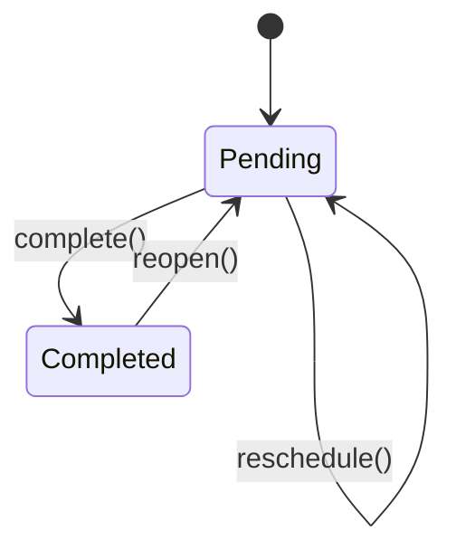

# Domain Model

---

## Task
A unit of work.

Rules:
- A task belongs to exactly one list
- A task can be done or not
- A task may repeat (for daily tasks)
- A change in 'repeat_on' must generated a task to be generated, preserving history
- recurring tasks (repeat_on not NULL) must use created_at and deleted_at (when deleted)

Attributes:
- id
- list_id
- text
- done (only if repeat_on is NULL)
- repeat_on (NULL if non-repeatable)
- created_at
- deleted_at

---

## Task Completions
Used to keep track of the completion of recurring tasks

Rules:
- Each completion belongs to one task
- Task + Date cannot be repeated across completions
- Created on "done", removed when "undone"
- Completions can only be associated to tasks with valid 'repeat_on' (not NULL)

Attributes:
- task_id
- date

---

## List
Depending on its type, a list may contain tasks or other lists.

Types:
- todo: contains regular tasks. One fixed for regular tasks.
- daily: derives tasks for the current day, refreshes daily for routines/habits. One fixed for daily tasks.
- collection: groups other lists for categorization. Lists can be 'todo' or 'daily'

Rules:
- A todo or daily list contains tasks
- A collection list contains other lists
- A list may belong to at most one collection

Attributes:
- id
- parent_id (NULL if doesn't belong to a collection)
- name
- type

---

## Diagrams

### Core Domain Relationships

### TODO: Task Lifecycle with Sync

<!-- TODO -->
